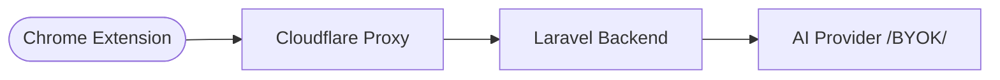

# 🚀 Quick Resume Tailor

**Quick Resume Tailor** is a powerful, privacy-first, and 100% cost-free tool designed to help job seekers tailor their resumes for specific job descriptions in seconds. 

By using a **"Bring Your Own Key" (BYOK)** architecture, this tool removes the cost barrier for developers and gives users absolute control over which AI provider they use (Grok, OpenAI, Groq, etc.).

---

## 🏗️ Architecture

This project uses a high-security "Proxy Mask" architecture to ensure the backend server remains hidden and protected from unauthorized use.

### Key Features:
- **Zero-Cost Deployment**: Stateless backend that relies on user-provided keys.
- **Privacy-First**: Your personal resume data isn't stored permanently; it's parsed and processed on-the-fly.
- **Universal AI Support**: Compatible with any OpenAI-style API (Grok, OpenRouter, DeepSeek, etc.).
- **Live Preview**: Real-time resume data visualization in the extension.
- **Stealth Protection**: Backend API masked behind Cloudflare to prevent direct discovery.

---

## 📂 Project Structure

- `backend/`: Laravel 11 API handling resume parsing and PDF generation.
- `extension/`: React + Vite Chrome Extension for job extraction and UI.

---

## 🛠️ Quick Start

### 1. Backend Setup
1. Enter the `backend/` directory.
2. Run `composer install`.
3. Set up your `.env` (See `backend/deployment_guide.md` for details).
4. Run `php artisan migrate`.
5. Start the server: `php artisan serve`.

### 2. Extension Setup
1. Enter the `extension/` directory.
2. Run `npm install` and `npm run build`.
3. Open Chrome and go to `chrome://extensions`.
4. Enable **Developer Mode**.
5. Click **Load Unpacked** and select the `extension/dist` folder.

---

## 🔒 Security & Masking

This project implements **Aggressive Domain Masking**. All backend URLs and secrets are fragmented and obfuscated within the minified build to prevent simple reverse-engineering. For production, it is recommended to use the **Cloudflare Worker Proxy** included in the documentation.

---

## 📄 License
MIT License - Feel free to use and contribute!

---

*Created with ❤️ by Zeeshan*
